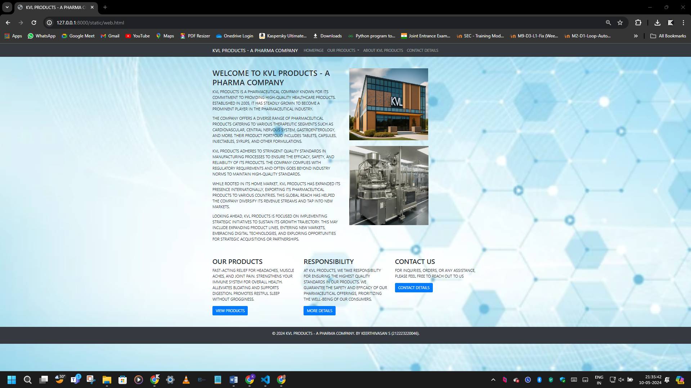
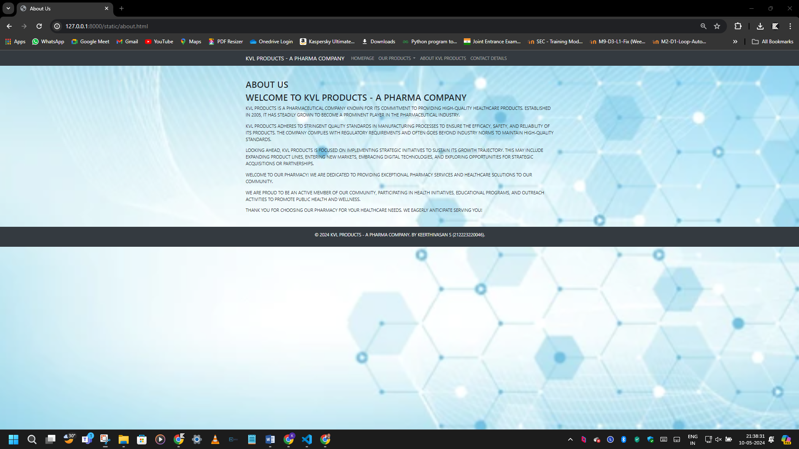

# Project Responsive Web Design using Bootstrap

## Date : 10/05/2024

## AIM:
To design a responsive website for a Pharmaceutical Company using Bootstrap.


## DESIGN STEPS:

### Step 1:
Clone the repository from GitHub.

### Step 2:
Create Django Admin project.

### Step 3:
Create a New App under the Django Admin project.

### Step 4:
Insert the necessary CSS and JavaScript files as external in order to use Bootstrap.

### Step 5:
Create a HTML file and include the needed Bootstrap components.

### Step 6:
Publish the website in the LocalHost.

## PROGRAM :

web.html

```
<!DOCTYPE html>
<html lang="en">
<head>
  <meta charset="UTF-8">
  <meta name="viewport" content="width=device-width, initial-scale=1.0">
  <title>KVL PRODUCTS - A PHARMA COMPANY</title>
  <link rel="stylesheet" href="https://stackpath.bootstrapcdn.com/bootstrap/4.5.2/css/bootstrap.min.css">
  <style>
    body {
      background-image: url('bgimage.png');
      background-size: cover;
      background-repeat: no-repeat;
      background-attachment: fixed;
    }
  </style>
</head>
<body>

  <!-- Navigation Bar -->
  <nav class="navbar navbar-expand-lg navbar-dark bg-dark">
    <div class="container">
      <a class="navbar-brand" href="web.html">KVL PRODUCTS - A PHARMA COMPANY</a>
      <button class="navbar-toggler" type="button" data-toggle="collapse" data-target="#navbarNav" aria-controls="navbarNav" aria-expanded="false" aria-label="Toggle navigation">
        <span class="navbar-toggler-icon"></span>
      </button>
      <div class="collapse navbar-collapse" id="navbarNav">
        <ul class="navbar-nav">
          <li class="nav-item">
            <a class="nav-link" href="web.html">HOMEPAGE</a>
          </li>
          <li class="nav-item dropdown">
            <a class="nav-link dropdown-toggle" href="products.html" id="navbarDropdown" role="button" data-toggle="dropdown" aria-haspopup="true" aria-expanded="false">
              OUR PRODUCTS
            </a>
            <div class="dropdown-menu" aria-labelledby="navbarDropdown">
              <a class="dropdown-item" href="products.html">MEDICINES</a>
              <a class="dropdown-item" href="products.html">VACCINES</a>
              <a class="dropdown-item" href="products.html">SUPPLEMENTS TABLETS</a>
            </div>
          </li>
          <li class="nav-item">
            <a class="nav-link" href="about.html">ABOUT KVL PRODUCTS</a>
          </li>
          <li class="nav-item">
            <a class="nav-link" href="contact.html">CONTACT DETAILS</a>
          </li>
        </ul>
      </div>
    </div>
  </nav>

  <!-- Content Sections -->
  <div class="container mt-5">
    <div class="row">
      <div class="col-md-6">
        <h2>WELCOME TO KVL PRODUCTS - A PHARMA COMPANY</h2>
        <p>KVL PRODUCTS IS A PHARMACEUTICAL COMPANY KNOWN FOR ITS COMMITMENT TO PROVIDING HIGH-QUALITY HEALTHCARE PRODUCTS. ESTABLISHED IN 2005, IT HAS STEADILY GROWN TO BECOME A PROMINENT PLAYER IN THE PHARMACEUTICAL INDUSTRY.</p>
        <p>THE COMPANY OFFERS A DIVERSE RANGE OF PHARMACEUTICAL PRODUCTS CATERING TO VARIOUS THERAPEUTIC SEGMENTS SUCH AS CARDIOVASCULAR, CENTRAL NERVOUS SYSTEM, GASTROENTEROLOGY, AND MORE. THEIR PRODUCT PORTFOLIO INCLUDES TABLETS, CAPSULES, INJECTABLES, SYRUPS, AND OTHER FORMULATIONS.</p>
        <p>KVL PRODUCTS ADHERES TO STRINGENT QUALITY STANDARDS IN MANUFACTURING PROCESSES TO ENSURE THE EFFICACY, SAFETY, AND RELIABILITY OF ITS PRODUCTS. THE COMPANY COMPLIES WITH REGULATORY REQUIREMENTS AND OFTEN GOES BEYOND INDUSTRY NORMS TO MAINTAIN HIGH-QUALITY STANDARDS.</p>
        <p>WHILE ROOTED IN ITS HOME MARKET, KVL PRODUCTS HAS EXPANDED ITS PRESENCE INTERNATIONALLY, EXPORTING ITS PHARMACEUTICAL PRODUCTS TO VARIOUS COUNTRIES. THIS GLOBAL REACH HAS HELPED THE COMPANY DIVERSIFY ITS REVENUE STREAMS AND TAP INTO NEW MARKETS.</p>
        <p>LOOKING AHEAD, KVL PRODUCTS IS FOCUSED ON IMPLEMENTING STRATEGIC INITIATIVES TO SUSTAIN ITS GROWTH TRAJECTORY. THIS MAY INCLUDE EXPANDING PRODUCT LINES, ENTERING NEW MARKETS, EMBRACING DIGITAL TECHNOLOGIES, AND EXPLORING OPPORTUNITIES FOR STRATEGIC ACQUISITIONS OR PARTNERSHIPS.</p>
      </div>
      <div class="col-md-6">
        
        <br> </br>
        
      </div>
    </div>
    <div class="row mt-5">
      <div class="col-md-4">
        <h3>OUR PRODUCTS</h3>
        <p>FAST-ACTING RELIEF FOR HEADACHES, MUSCLE ACHES, AND JOINT PAIN.
            STRENGTHENS YOUR IMMUNE SYSTEM FOR OVERALL HEALTH.
            ALLEVIATES BLOATING AND SUPPORTS DIGESTION.
            PROMOTES RESTFUL SLEEP WITHOUT GROGGINESS.
            </p>
        <a href="#" class="btn btn-primary">VIEW PRODUCTS</a>
      </div>
      <div class="col-md-4">
        <h3>RESPONSIBILITY</h3>
        <p>AT KVL PRODUCTS, WE TAKE RESPONSIBILITY FOR ENSURING THE HIGHEST QUALITY STANDARDS IN OUR PRODUCTS. WE GUARANTEE THE SAFETY AND EFFICACY OF OUR PHARMACEUTICAL OFFERINGS, PRIORITIZING THE WELL-BEING OF OUR CONSUMERS.
         </p>
        <a href="#" class="btn btn-primary">MORE DETAILS</a>
      </div>
      <div class="col-md-4">
        <h3>CONTACT US</h3>
        <p>FOR INQUIRIES, ORDERS, OR ANY ASSISTANCE, PLEASE FEEL FREE TO REACH OUT TO US </p>
        <a href="#" class="btn btn-primary">CONTACT DETAILS</a>
      </div>
    </div>
  </div>

  <!-- Footer -->
  <footer class="bg-dark text-light mt-5 py-3">
    <div class="container text-center">
      <p>&copy; 2024 KVL PRODUCTS - A PHARMA COMPANY. BY KEERTHIVASAN S (212223220046).</p>
    </div>
  </footer>

  <script src="https://code.jquery.com/jquery-3.5.1.slim.min.js"></script>
  <script src="https://cdn.jsdelivr.net/npm/@popperjs/core@2.9.2/dist/umd/popper.min.js"></script>
  <script src="https://stackpath.bootstrapcdn.com/bootstrap/4.5.2/js/bootstrap.min.js"></script>
</body>
</html>
```

products.html

```
<!DOCTYPE html>
<html lang="en">
<head>
  <meta charset="UTF-8">
  <meta name="viewport" content="width=device-width, initial-scale=1.0">
  <title>Our Products</title>
  <link rel="stylesheet" href="https://stackpath.bootstrapcdn.com/bootstrap/4.5.2/css/bootstrap.min.css">
  <style>
    body {
      background-image: url('bgimage.png');
      background-size: cover;
      background-repeat: no-repeat;
      background-attachment: fixed;
    }
  </style>
  <style>
    .rounded-img {
      border-radius: 50%;
      overflow: hidden;
    }
  </style>
</head>
<body>

  <!-- Navigation Bar -->
  <nav class="navbar navbar-expand-lg navbar-dark bg-dark">
    <div class="container">
      <a class="navbar-brand" href="products.html">KVL PRODUCTS - A PHARMA COMPANY</a>
      <button class="navbar-toggler" type="button" data-toggle="collapse" data-target="#navbarNav" aria-controls="navbarNav" aria-expanded="false" aria-label="Toggle navigation">
        <span class="navbar-toggler-icon"></span>
      </button>
      <div class="collapse navbar-collapse" id="navbarNav">
        <ul class="navbar-nav">
          <li class="nav-item">
            <a class="nav-link" href="web.html">HOMEPAGE</a>
          </li>
          <li class="nav-item dropdown">
            <a class="nav-link dropdown-toggle" href="products.html" id="navbarDropdown" role="button" data-toggle="dropdown" aria-haspopup="true" aria-expanded="false">
              OUR PRODUCTS
            </a>
            <div class="dropdown-menu" aria-labelledby="navbarDropdown">
              <a class="dropdown-item" href="products.html">MEDICINES</a>
              <a class="dropdown-item" href="products.html">VACCINES</a>
              <a class="dropdown-item" href="products.html">SUPPLEMENTS TABLETS</a>
            </div>
          </li>
          <li class="nav-item">
            <a class="nav-link" href="about.html">ABOUT KVL PRODUCTS</a>
          </li>
          <li class="nav-item">
            <a class="nav-link" href="contact.html">CONTACT DETAILS</a>
          </li>
        </ul>
      </div>
    </div>
  </nav>

  <!-- Product Content -->
  <div class="container mt-5">
    <h2 class="text-center mb-4">WHAT WE PROVIDE</h2>
    <div class="row">
      <div class="col-md-4">
        <div class="card mb-4">
          
          <div class="card-body">
            <h5 class="card-title">DOLO 650</h5>
            <p class="card-text">DOLO 650 : FAST - ACTING RELIEF FOR PAIN AND FEVER.</p>
            <a href="#" class="btn btn-primary btn-block">Buy Now</a>
          </div>
        </div>
      </div>
      <div class="col-md-4">
        <div class="card mb-4">
          
          <div class="card-body">
            <h5 class="card-title">CROCIN 650</h5>
            <p class="card-text">CROCIN 650 : TRUSTED RELEIF FOR PAIN AND FEVER.</p>
            <a href="#" class="btn btn-primary btn-block">Buy Now</a>
          </div>
        </div>
      </div>
      <div class="col-md-4">
        <div class="card mb-4">
          
          <div class="card-body">
            <h5 class="card-title">CETIRIZINE</h5>
            <p class="card-text">CETIRIZINE : EFFECTIVE RELIEF FROM ALLERGIES AND HAY FEVER SYMPTOMS.</p>
            <a href="#" class="btn btn-primary btn-block">Buy Now</a>
          </div>
        </div>
      </div>
    </div>
  </div>
    <!-- Footer -->
    <footer class="bg-dark text-light mt-5 py-3">
      <div class="container text-center">
        <p>&copy; 2024 KVL PRODUCTS - A PHARMA COMPANY. BY KEERTHIVASAN S (212223220046).</p>
      </div>
    </footer>

  <!-- Bootstrap JS dependencies -->
  <script src="https://code.jquery.com/jquery-3.5.1.slim.min.js"></script>
  <script src="https://cdn.jsdelivr.net/npm/@popperjs/core@2.9.2/dist/umd/popper.min.js"></script>
  <script src="https://stackpath.bootstrapcdn.com/bootstrap/4.5.2/js/bootstrap.min.js"></script>
</body>
</html>
```

about.html

```
<!DOCTYPE html>
<html lang="en">
<head>
  <meta charset="UTF-8">
  <meta name="viewport" content="width=device-width, initial-scale=1.0">
  <title>About Us</title>
  <link rel="stylesheet" href="https://stackpath.bootstrapcdn.com/bootstrap/4.5.2/css/bootstrap.min.css">
  <style>
    body {
      background-image: url('bgimage.png');
      background-size: cover;
      background-repeat: no-repeat;
      background-attachment: fixed;
    }
  </style>
</head>
<body>

  <!-- Navigation Bar -->
  <nav class="navbar navbar-expand-lg navbar-dark bg-dark">
    <div class="container">
      <a class="navbar-brand" href="products.html">KVL PRODUCTS - A PHARMA COMPANY</a>
      <button class="navbar-toggler" type="button" data-toggle="collapse" data-target="#navbarNav" aria-controls="navbarNav" aria-expanded="false" aria-label="Toggle navigation">
        <span class="navbar-toggler-icon"></span>
      </button>
      <div class="collapse navbar-collapse" id="navbarNav">
        <ul class="navbar-nav">
          <li class="nav-item">
            <a class="nav-link" href="web.html">HOMEPAGE</a>
          </li>
          <li class="nav-item dropdown">
            <a class="nav-link dropdown-toggle" href="products.html" id="navbarDropdown" role="button" data-toggle="dropdown" aria-haspopup="true" aria-expanded="false">
              OUR PRODUCTS
            </a>
            <div class="dropdown-menu" aria-labelledby="navbarDropdown">
              <a class="dropdown-item" href="products.html">MEDICINES</a>
              <a class="dropdown-item" href="products.html">VACCINES</a>
              <a class="dropdown-item" href="products.html">SUPPLEMENTS TABLETS</a>
            </div>
          </li>
          <li class="nav-item">
            <a class="nav-link" href="about.html">ABOUT KVL PRODUCTS</a>
          </li>
          <li class="nav-item">
            <a class="nav-link" href="contact.html">CONTACT DETAILS</a>
          </li>
        </ul>
      </div>
    </div>
  </nav>

  <!-- About Content -->
  <div class="container mt-5">
    <h2>ABOUT US</h2>
    <h2>WELCOME TO KVL PRODUCTS - A PHARMA COMPANY</h2>
    <p>KVL PRODUCTS IS A PHARMACEUTICAL COMPANY KNOWN FOR ITS COMMITMENT TO PROVIDING HIGH-QUALITY HEALTHCARE PRODUCTS. ESTABLISHED IN 2005, IT HAS STEADILY GROWN TO BECOME A PROMINENT PLAYER IN THE PHARMACEUTICAL INDUSTRY.</p>
    <p>KVL PRODUCTS ADHERES TO STRINGENT QUALITY STANDARDS IN MANUFACTURING PROCESSES TO ENSURE THE EFFICACY, SAFETY, AND RELIABILITY OF ITS PRODUCTS. THE COMPANY COMPLIES WITH REGULATORY REQUIREMENTS AND OFTEN GOES BEYOND INDUSTRY NORMS TO MAINTAIN HIGH-QUALITY STANDARDS.</p>
    <p>LOOKING AHEAD, KVL PRODUCTS IS FOCUSED ON IMPLEMENTING STRATEGIC INITIATIVES TO SUSTAIN ITS GROWTH TRAJECTORY. THIS MAY INCLUDE EXPANDING PRODUCT LINES, ENTERING NEW MARKETS, EMBRACING DIGITAL TECHNOLOGIES, AND EXPLORING OPPORTUNITIES FOR STRATEGIC ACQUISITIONS OR PARTNERSHIPS.</p>
    <p>WELCOME TO OUR PHARMACY! WE ARE DEDICATED TO PROVIDING EXCEPTIONAL PHARMACY SERVICES AND HEALTHCARE SOLUTIONS TO OUR COMMUNITY.</p>
    <p>WE ARE PROUD TO BE AN ACTIVE MEMBER OF OUR COMMUNITY, PARTICIPATING IN HEALTH INITIATIVES, EDUCATIONAL PROGRAMS, AND OUTREACH ACTIVITIES TO PROMOTE PUBLIC HEALTH AND WELLNESS.</p>
    <p>THANK YOU FOR CHOOSING OUR PHARMACY FOR YOUR HEALTHCARE NEEDS. WE EAGERLY ANTICIPATE SERVING YOU!</p>
  </div>
    <!-- Footer -->
    <footer class="bg-dark text-light mt-5 py-3">
        <div class="container text-center">
          <p>&copy; 2024 KVL PRODUCTS - A PHARMA COMPANY. BY KEERTHIVASAN S (212223220046).</p>
        </div>
      </footer>

  <!-- Bootstrap JS dependencies -->
  <script src="https://code.jquery.com/jquery-3.5.1.slim.min.js"></script>
  <script src="https://cdn.jsdelivr.net/npm/@popperjs/core@2.9.2/dist/umd/popper.min.js"></script>
  <script src="https://stackpath.bootstrapcdn.com/bootstrap/4.5.2/js/bootstrap.min.js"></script>
</body>
</html>
```

contact.html

```
<!DOCTYPE html>
<html lang="en">
<head>
  <meta charset="UTF-8">
  <meta name="viewport" content="width=device-width, initial-scale=1.0">
  <title>Contact Us</title>
  <link rel="stylesheet" href="https://stackpath.bootstrapcdn.com/bootstrap/4.5.2/css/bootstrap.min.css">
  <style>
    body {
      background-image: url('bgimage.png');
      background-size: cover;
      background-repeat: no-repeat;
      background-attachment: fixed;
    }
  </style>
</head>
<body>

   <!-- Navigation Bar -->
   <nav class="navbar navbar-expand-lg navbar-dark bg-dark">
    <div class="container">
      <a class="navbar-brand" href="products.html">KVL PRODUCTS - A PHARMA COMPANY</a>
      <button class="navbar-toggler" type="button" data-toggle="collapse" data-target="#navbarNav" aria-controls="navbarNav" aria-expanded="false" aria-label="Toggle navigation">
        <span class="navbar-toggler-icon"></span>
      </button>
      <div class="collapse navbar-collapse" id="navbarNav">
        <ul class="navbar-nav">
          <li class="nav-item">
            <a class="nav-link" href="web.html">HOMEPAGE</a>
          </li>
          <li class="nav-item dropdown">
            <a class="nav-link dropdown-toggle" href="products.html" id="navbarDropdown" role="button" data-toggle="dropdown" aria-haspopup="true" aria-expanded="false">
              OUR PRODUCTS
            </a>
            <div class="dropdown-menu" aria-labelledby="navbarDropdown">
              <a class="dropdown-item" href="products.html">MEDICINES</a>
              <a class="dropdown-item" href="products.html">VACCINES</a>
              <a class="dropdown-item" href="products.html">SUPPLEMENTS TABLETS</a>
            </div>
          </li>
          <li class="nav-item">
            <a class="nav-link" href="about.html">ABOUT KVL PRODUCTS</a>
          </li>
          <li class="nav-item">
            <a class="nav-link" href="contact.html">CONTACT DETAILS</a>
          </li>
        </ul>
      </div>
    </div>
  </nav>

  <!-- Contact Content -->
  <div class="container mt-5">
    <h2>Contact Us</h2>
    <p>DO YOU HAVE ANY PROBLEMS OR INQUIRIES OR FEEDBACKS, FELL FREE TO CONTACT US</p>
    <form>
      <div class="form-group">
        <label for="inputName">NAME</label>
        <input type="text" class="form-control" id="inputName" placeholder="ENTER YOUR NAME...">
      </div>
      <div class="form-group">
        <label for="inputPhone">PHONE NUMBER</label>
        <input type="tel" class="form-control" id="inputPhone" placeholder="ENTER YOUR PHONE NUMBER...">
      </div>
      <div class="form-group">
        <label for="inputEmail">EMAIL ADDRESS</label>
        <input type="email" class="form-control" id="inputEmail" aria-describedby="emailHelp" placeholder="ENTER YOUR EMAIL ID...">
      </div>
      <div class="form-group">
        <label for="inputMessage">MESSAGE</label>
        <textarea class="form-control" id="inputMessage" rows="5" placeholder="ENTER YOUR MESSAGE..."></textarea>
      </div>
      <button type="submit" class="btn btn-primary">Submit</button>
    </form>
  </div>
  <!-- Footer -->
  <footer class="bg-dark text-light mt-5 py-3">
    <div class="container text-center">
      <p>&copy; 2024 KVL PRODUCTS - A PHARMA COMPANY. BY KEERTHIVASAN S (212223220046).</p>
    </div>
  </footer>
  <!-- Bootstrap JS dependencies -->
  <script src="https://code.jquery.com/jquery-3.5.1.slim.min.js"></script>
  <script src="https://cdn.jsdelivr.net/npm/@popperjs/core@2.9.2/dist/umd/popper.min.js"></script>
  <script src="https://stackpath.bootstrapcdn.com/bootstrap/4.5.2/js/bootstrap.min.js"></script>
</body>
</html>
```

## OUTPUT:







## RESULT:
The Project for responsive web design using Bootstrap is completed successfully.
